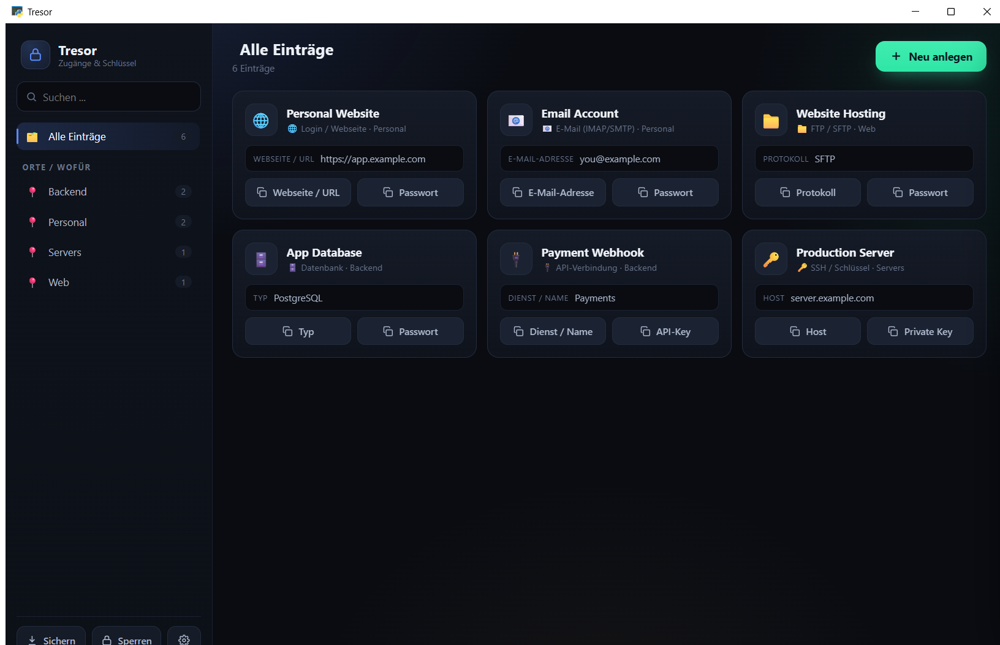
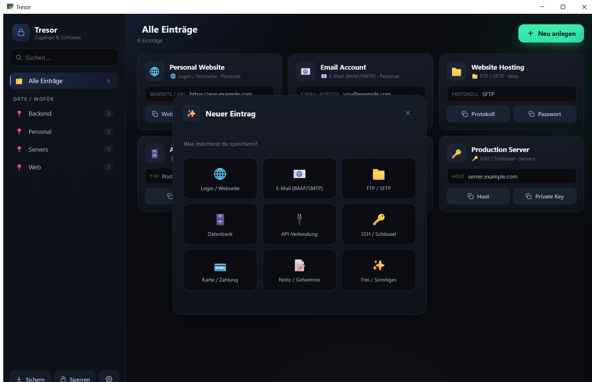
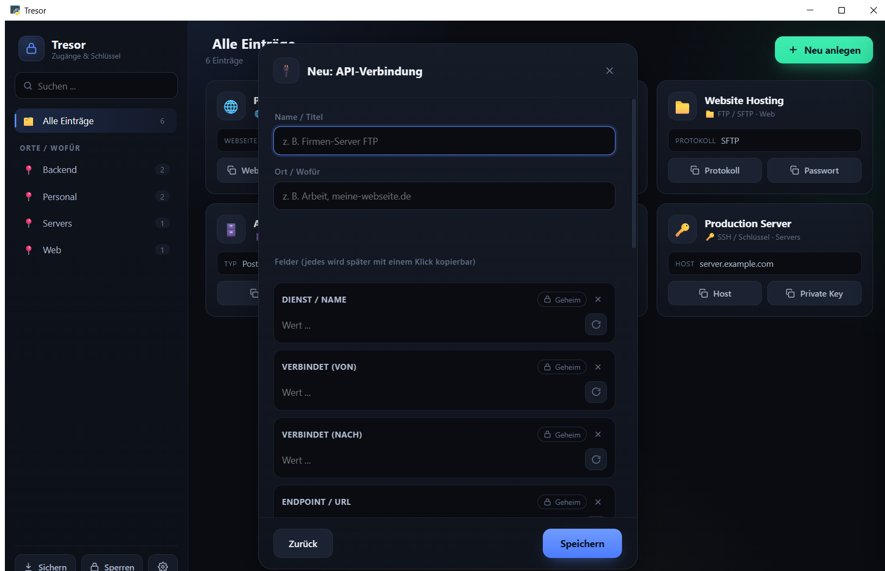
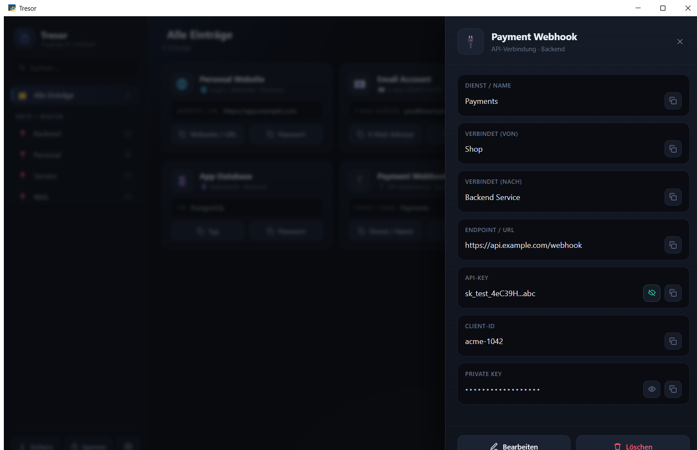

# 🔒 Tresor

**Your complete access, sealed in one local vault.**

A local, offline Desktop Credential Vault for Windows.

[](https://github.com/Juri-Halveth/halveth-tresor/actions/workflows/ci.yml)
[](LICENSE)
[](#requirements)
[](https://www.python.org/)
[](https://pywebview.flowrl.com/)
[](CHANGELOG.md)

Tresor is a fully offline vault for everything that gets you access: passwords, servers, keys, and secrets. It keeps them in a single encrypted file on your own machine, with no cloud, no account, and no telemetry.



---

## More than a password manager

Most tools remember passwords. Tresor remembers **complete access**. A password is rarely enough to reach a system: you also need the host, the port, the protocol, the key, the endpoint. Tresor stores the whole picture in one place, so a credential is actually usable, not just remembered.

It manages:

- Login credentials (username and password pairs)
- Websites and web logins
- FTP and SFTP servers
- SSH access
- API keys and API connections
- Databases
- Mail accounts (IMAP and SMTP)
- Cards
- Notes
- Any other secret information

Not just passwords. Complete access.

---

## Features

- **Organized by place and purpose.** Group entries into categories you name yourself, for example Work, Servers, or Personal.
- **One-click copy on every field.** Copy a username, a host, a port, or a key with a single click.
- **Tailored fields per type.** Each entry type shows the fields that actually matter for it. A mail account has IMAP and SMTP server and port. An API connection has "connects from", "connects to", endpoint, API key, public key, and private key.
- **Built-in password generator.** Create strong values without leaving the app.
- **Live search.** Filter across everything as you type.
- **Detail view with reveal.** Masked values stay hidden until you choose to show them.
- **Master password plus PIN.** Two separate secrets are combined to unlock the vault.
- **One-time recovery key.** A Base32 key lets you regain access if you forget the master password.
- **Auto-lock.** The vault locks after inactivity, and the in-memory key is wiped on lock and on close.
- **Encrypted backup export.** Save an encrypted copy of your vault to any location you choose.
- **Secure clipboard.** Copied secrets clear automatically after 15 seconds and are kept out of Windows clipboard history (Win+V) and cloud clipboard.
- **Fully offline.** No cloud, no account, no telemetry, no network calls.

---

## Screenshots

**Choose a type**



Pick what you are storing, from a login to an SSH server to an API connection.

**Tailored fields**



The form adapts to the type you chose and asks only for the fields that fit it.

**Detail view**



Review an entry, reveal masked values on demand, and copy any field with one click.

---

## Security

Tresor uses a standard envelope-encryption design. It is self-reviewed and has not undergone an independent third-party audit.

- Your **master password and a separate PIN** are combined (length-prefixed and NFC-normalized) and run through **Scrypt** to derive a Key Encryption Key (KEK). The Scrypt cost is calibrated to your machine when the vault is created and stored in the file.
- The KEK only wraps a random **Data Encryption Key (DEK)**. The DEK encrypts your actual data with **AES-256-GCM**.
- A fresh random nonce (`os.urandom`) is used for every encryption on every save.
- The header (KDF cost and salt) is bound as AES-GCM associated data, so it cannot be silently downgraded.
- A SHA-256 checksum over the ciphertext tells a corrupted file apart from a wrong password.
- The design is **fail-closed**: a wrong password or PIN is indistinguishable from a bad auth tag, so the vault never opens on doubt.
- A one-time **Recovery Key** (Base32) is the same DEK wrapped a second time under a random key, so a forgotten password can be reset.
- The vault file lives at `%APPDATA%\Tresor\vault.credvault`, holds ciphertext only, and is written atomically.

### Honest limits

Security claims should be plain, so here are the boundaries:

- Tresor protects a **stolen or copied file**. Without the master password, PIN, or recovery key, that file is useless to an attacker.
- Tresor does **not** protect against malware or a keylogger that is already running on your PC while the vault is unlocked. If the machine is compromised, the vault cannot save you.
- If you lose the master password **and** the PIN **and** the recovery key, the data is gone forever, by design. There is no backdoor.
- For defense in depth, enable **BitLocker** on your system drive.

Full details are in [docs/security-model.md](docs/security-model.md). To report a vulnerability, see [SECURITY.md](SECURITY.md).

---

## Why Tresor exists

Software should solve real problems. Not every small feature needs a monthly subscription. The goal is to build modern, fast, high-quality desktop programs that make people more productive.

Some projects stay free, some become open source, and others are fair one-time purchases. Tresor is part of a growing line of tools under Halveth.

---

## Download

Tresor is distributed through **GitHub Releases**. Each release includes the Windows `.exe`, the changelog, the version, a SHA-256 hash of the exe, and a description.

1. Download `Tresor.exe` from the Releases page: `https://github.com/Juri-Halveth/halveth-tresor/releases`
2. Verify the SHA-256 hash against the value published with the release:

   ```powershell
   Get-FileHash .\Tresor.exe -Algorithm SHA256
   ```

   Compare the printed hash to the one in the release notes. Only run the file if they match.
3. Put the exe anywhere you like and, optionally, create a desktop shortcut.

It is a **portable single file**. No installer, no admin rights, nothing written outside your user profile.

<a id="requirements"></a>

### Requirements

- Windows 10 or 11 (x64).
- The WebView2 runtime, which is preinstalled on Windows 11 and on up-to-date Windows 10.

---

## Build from source

Requires Python 3.10 or newer (developed and tested on 3.13) on Windows.

```powershell
# Clone
git clone https://github.com/Juri-Halveth/halveth-tresor.git
cd halveth-tresor

# Install in editable mode with dev dependencies
pip install -e ".[dev]"

# Run from source
python -m tresor

# Run the tests
pytest

# Build the single-file exe (output: dist/Tresor.exe)
scripts\build.bat
# or equivalently:
python -m PyInstaller packaging/tresor.spec --clean --noconfirm
```

The test suite covers roundtrip encryption with no plaintext on disk, wrong password and PIN fail-closed, tamper detection, blocked Scrypt downgrade, recovery key, password change that keeps data, the key being wiped on lock, and helper functions.

---

## Project structure

```text
tresor/
├─ src/tresor/
│  ├─ __init__.py          # __version__ = "1.0.0"
│  ├─ __main__.py          # entry point, enables python -m tresor
│  ├─ app.py               # window and JS bridge
│  ├─ vault.py             # encrypted core
│  ├─ clipboard_win.py     # secure clipboard
│  └─ ui/index.html        # the whole UI
├─ tests/
│  ├─ test_vault.py        # pytest suite
│  └─ e2e/native_smoke.py  # manual native smoke test (not run in CI)
├─ assets/
│  ├─ icon.ico
│  └─ screenshots/         # dashboard, add-type, add-form, detail
├─ scripts/
│  ├─ build.bat
│  └─ make_icon.py
├─ packaging/
│  └─ tresor.spec          # committed PyInstaller spec
├─ docs/
│  └─ security-model.md
├─ .github/
│  ├─ workflows/ci.yml
│  ├─ ISSUE_TEMPLATE/
│  └─ PULL_REQUEST_TEMPLATE.md
├─ README.md
├─ LICENSE
├─ SECURITY.md
├─ CONTRIBUTING.md
├─ CHANGELOG.md
├─ THIRD-PARTY-LICENSES.md
├─ pyproject.toml
├─ requirements.txt
├─ requirements-dev.txt
└─ .gitignore
```

---

## Roadmap

Modest and honest, in no fixed order:

- Optional English UI and full internationalization (the UI ships in German today).
- Code signing of the released exe.
- Encrypted, cloud-agnostic backup helpers that keep the offline model intact.

---

## About the developer

**Juri Janovski**, Germany. Founder of Halveth. Building modern software, desktop applications, and digital tools with a focus on simplicity, speed, and fair pricing.

- Website: https://halveth.de
- GitHub: https://github.com/Juri-Halveth

---

## License

Tresor is released under the **MIT License**. See [LICENSE](LICENSE).

Copyright (c) 2026 Juri Janovski.

Bundled dependencies are permissive and MIT-compatible. Their notices, including the OpenSSL attribution required by the statically linked `cryptography` wheel, are collected in [THIRD-PARTY-LICENSES.md](THIRD-PARTY-LICENSES.md).

---

Contributions are welcome: see [CONTRIBUTING.md](CONTRIBUTING.md). To report a security issue, see [SECURITY.md](SECURITY.md).